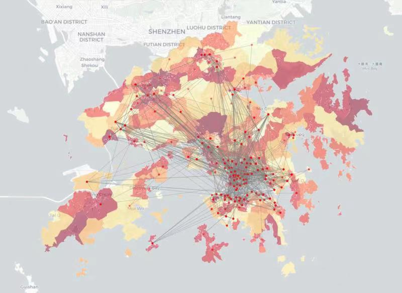
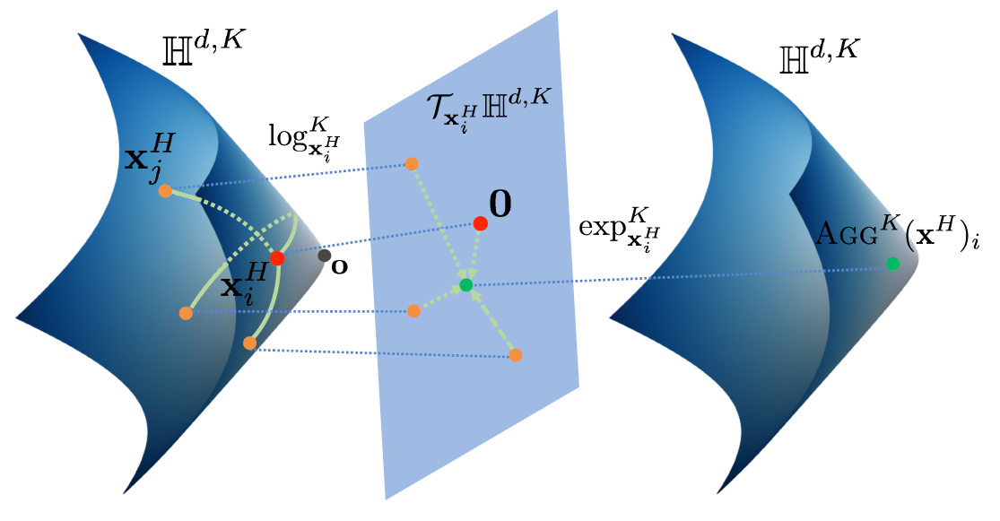
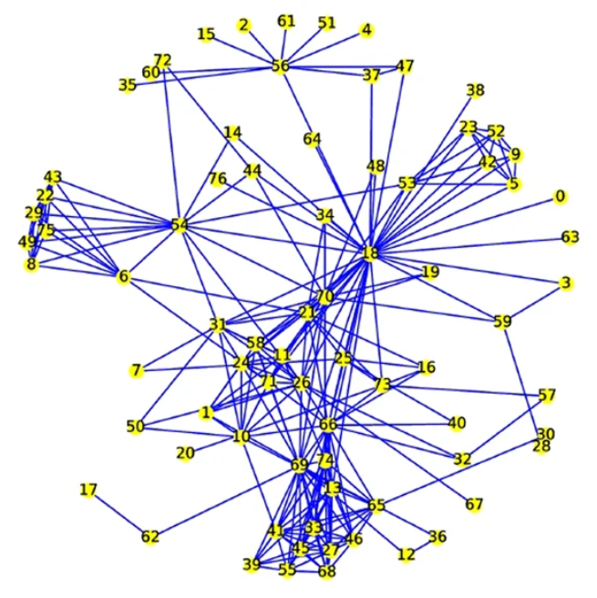
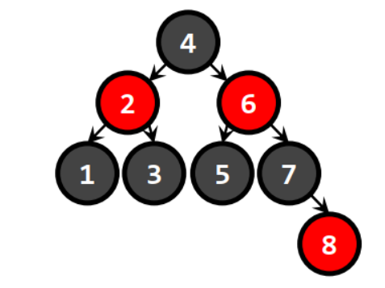
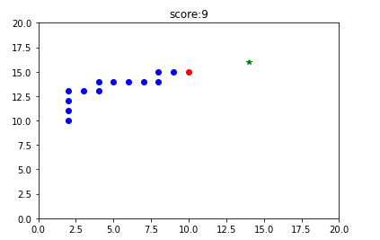
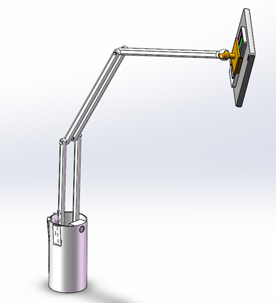
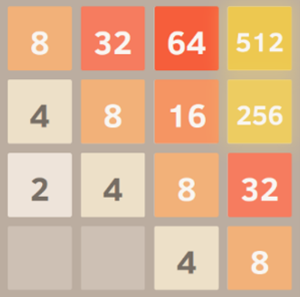
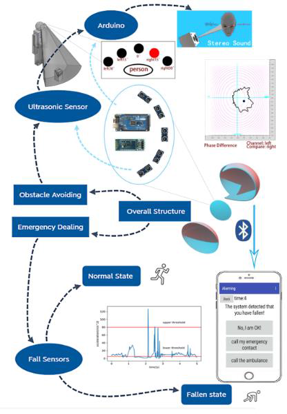
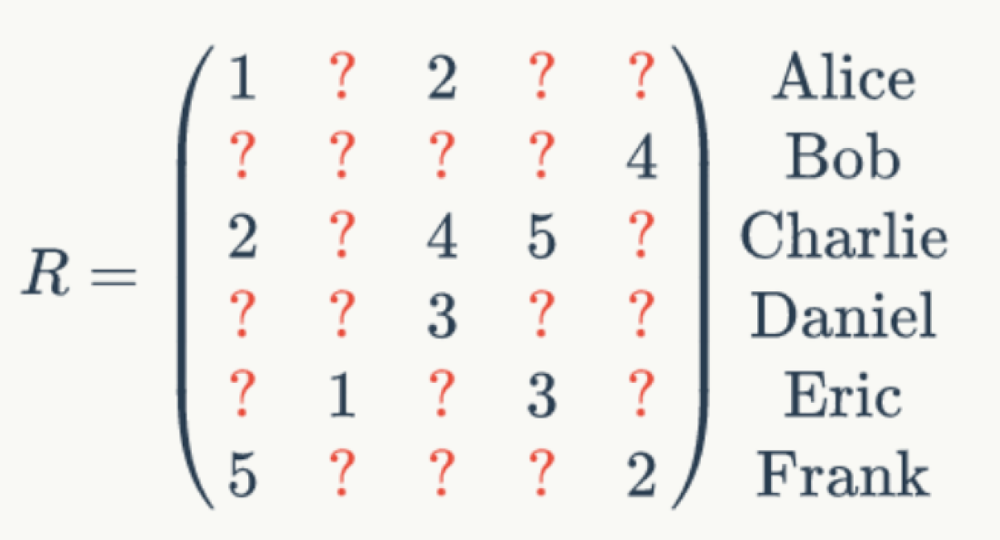

I am currently a fourth-year undergraduate student at [Beihang University](www.buaa.edu.cn)  I will become a Ph.D. student at the Department of Computer Science and Engineering, The Chinese University of Hong Kong (CUHK), under the supervision of [Prof. Hong Xu](https://henryhxu.github.io/).

My research interests lie on federated learning.

## Education

   <table style="width:100%;border:0px;border-spacing:0px;border-collapse:separate;margin-right:auto;margin-left:auto;">
                <tbody>
                    <tr>
                        <td style="padding:20px;width:30%;vertical-align:middle">
                            
                        </td>
                        <td style="padding:20px;width:100%;vertical-align:middle">
                                <papertitle>The Chinese University of Hong Kong, Hong Kong SAR
                            </papertitle>
                            

                            <em>Ph.D. in Computer Science and Engineering</em>,  Forthcoming
                            

                        </td>
                    </tr>
                    <tr>
                        <td style="padding:20px;width:30%;vertical-align:middle">
                            
                        </td>
                        <td style="padding:20px;width:100%;vertical-align:middle">
                                <papertitle>Beihang University, China</papertitle>
                            

                            <em>BEng in mechanical engineering (with honors)</em>   2019.09 - 2023.06(expected)
                            

                            <strong>GPA:</strong>3.82/4 <strong>Weighted Score:</strong>91.5/100 
                            
Courses: Calculus (100/100), Computer Science and Programming (100/100), Data Management and Artifitial Intelligence (100/100), Probability and Statistic (100/100), Introduction to deep learning and its applications (96/100), Linear Algebra (95/100), Natural Language Processing (91/100) 

                        </td>
                    </tr>
                </tbody>
            </table>

## Publications

 <table style="width:100%;border:0px;border-spacing:0px;border-collapse:separate;margin-right:auto;margin-left:auto;">
                <tbody>
                    <tr>
                        <td style="padding:20px;width:30%;vertical-align:middle">
                            
                        </td>
                        <td width="100%" valign="middle">
                            <a href="https://link.springer.com/article/10.1007/s00500-021-06475-w">
                                <papertitle>Efficient network dismantling through genetic algorithms</papertitle>
                            </a>
                             
                            <strong>Wei Lin</strong>, <a href="http://m3nets.de/group/sw.html">Sebastian Wandelt,</a> <a href="http://m3nets.de/group/xs.html">Xiaoqian Sun</a>
                             
                            <em>Soft Computing</em>, 2021  <strong>IF=3.732 (Q2)</strong>
                             
                            <a href="../files/SOCO.pdf">pdf</a> 
                            
In this study, we propose a novel network attack technique based on genetic algorithms. Results show that our novel technique significantly outperforms the state-of-the-art methods, providing an interesting sweet spot between attack quality and computational complexity.

                        </td>
                    </tr>
                    <tr>
                        <td style="padding:20px;width:30%;vertical-align:middle">
                            
                        </td>
                        <td width="100%" valign="middle">
                            <a href="https://www.sciencedirect.com/science/article/abs/pii/S0951832021006335?via%3Dihub">
                                <papertitle>From random failures to targeted attacks in network dismantling</papertitle>
                            </a>
                             
                            <a href="http://m3nets.de/group/sw.html">Sebastian Wandelt</a>, <strong>Wei Lin</strong>, <a href="http://m3nets.de/group/xs.html">Xiaoqian Sun</a>
                             
                            <em>Reliability Engineering & System Safety</em>, 2021  <strong>IF=7.247 (Q1) </strong>
                             
                            <a href="../files/RESS.pdf">pdf</a>
                            
In this study, we propose a novel perspective to solve the network dismantling problem. Instead of designing an effective attack from scratch, we show how knowledge extracted from random failures in the network leads to extremely effective attacks. Experiments on a wide range of networks show the
efficacy of our novel method for network dismantling, providing an excellent trade-off between attack quality
and scalability.

                        </td>
                    </tr>
                </tbody>
            </table>
## Undergraduate Research Experiences

<table style="width:100%;border:0px;border-spacing:0px;border-collapse:separate;margin-right:auto;margin-left:auto;">
                <tbody>
                    <tr>
                        <td style="padding:20px;width:30%;vertical-align:middle">
                            
                        </td>
                        <td style="padding:20px;width:100%;vertical-align:middle">
                            <papertitle>Impact of Non-Pharmaceutical Interventions in the COVID-19 Pandemic</papertitle>
                            

                            

                            2022.03 - 2022.12
                             
                            Supervised by <a href="https://sites.google.com/view/lijia">Prof. Jia Li</a>
                             
                            <ul style="padding-left:20px;margin:5px">
                                <li>
                                    Proposed a method based on deep point process to predict the trajectory of confirmed case. 
                                </li>
                                <li>
                                    Modelling and studying the impact of government policies on the spread of epidemics.
                                </li>
                            </ul>
                        </td>
                    </tr>
                    <tr>
                        <td style="padding:20px;width:30%;vertical-align:middle">
                            
                        </td>
                        <td style="padding:20px;width:100%;vertical-align:middle">
                            <papertitle>Graph learning on Hyperbolic Space</papertitle>
                            

                            

                            2022.03 - 2022.08
                             
                            Supervised by <a href="https://www.cse.cuhk.edu.hk/irwin.king/home">Prof. Irwin King</a> and <a href="https://yangmenglin.site/">Dr. Menglin Yang</a>
                             
                            <ul style="padding-left:20px;margin:5px">
                                <li>
                                    Studying how to build graph neutral networks in a Riemannian space.
                                </li>
                                <li>
                                    Studying the application of hyperbolic graph neural networks in recommendation system.
                                </li>
                            </ul>
                        </td>
                    </tr>
                    <tr>
                        <td style="padding:20px;width:30%;vertical-align:middle">
                            
                        </td>
                        <td style="padding:20px;width:100%;vertical-align:middle">
                            <papertitle>Complex network robustness: What are the fundamental principles underlying the robustness of a connected system?</papertitle>
                            

                            

                            2020.07 - 2021.04
                             
                            Supervised by <a href="http://m3nets.de/group/sw.html">Prof. Sebastian Wandelt</a> and <a href="http://m3nets.de/group/xs.html">Prof. Xiaoqian Sun</a>
                             
                            <ul style="padding-left:20px;margin:5px">
                                <li>
                                    Designed an exact method for measuring the effectiveness of a dismantling strategy for a network with linear runtime of the
network size, which is significant faster than existing methods
                                </li>
                                <li>
                                    Proposed novel network dismantle techniques based on genetic algorithms and percolation process. 
                                </li>
                            </ul>
                        </td>
                    </tr>
                </tbody>
            </table>

## Teaching Assistance

   <table style="width:100%;border:0px;border-spacing:0px;border-collapse:separate;margin-right:auto;margin-left:auto;">
                <tbody>
                    <tr>
                        <td style="padding:20px;width:30%;vertical-align:middle">
                            
                        </td>
                        <td style="padding:20px;width:100%;vertical-align:middle">
                                <papertitle>Introduction to Computer Science and Programming</papertitle>
                            

                            2020.09-2021.01
                             
                            Instructor: <a href='http://m3nets.de/group/sw.html'>Prof. Sebastian Wandelt</a>
                            <ul style="padding-left:20px;margin:5px">
                            <li>Fundemantal of python</li>
                            <li>Algorithms:  sorting (insert sort, bubble sort, merge sort, ...), integer multiplication, select-k</li>
                            <li>Data structure: binary search trees, red-black tree, hash table,  heaps, stacks, queues</li>
                                <li>Graph:  depth-first search, breadth-first search, shortest path, minimum spanning tree</li>
                            </ul>
                        </td>
                    </tr>      
                    <tr>
                        <td style="padding:20px;width:30%;vertical-align:middle">
                            
                        </td>
                        <td style="padding:20px;width:100%;vertical-align:middle">
                                <papertitle>Data Management and Artifitial Intelligence</papertitle>
                            

                            2021.03-2021.06
                             
                            Instructor: <a href='http://m3nets.de/group/sw.html'>Prof. Sebastian Wandelt</a>
                            <ul style="padding-left:20px;margin:5px">
                            <li>Data analysis, database system, SQL</li>
                            <li>Visualization: matplotlib, seaborn</li>
                            <li>Semantic web</li>
                            <li>Heuristics: A*, genetic algorithms, monte-carlo tree search</li>
                                <li>Neural networks</li>
                            </ul>
                        </td>
                    </tr>    
                </tbody>
            </table>

## Course Project

 <table style="width:100%;border:0px;border-spacing:0px;border-collapse:separate;margin-right:auto;margin-left:auto;">
                <tbody>
                    <tr>
                        <td style="padding:20px;width:30%;vertical-align:middle">
                            
                        </td>
                        <td style="padding:20px;width:100%;vertical-align:middle">
                            <papertitle>Unveil the Mystery behind Musical Evolution</papertitle>
                            

                            <strong> The finalist price of Interdisplinary Contest In Modeling</strong> <strong>(Top 1% among candidates worldwide)</strong> <a href='../files/icmmcm_certificate.pdf'>Certificate of Achievement</a>
                            

                            2021.02  
                             
                            Supervised by <a href="http://m3nets.de/group/sw.html">Prof. Sebastian Wandelt</a>
                             
                            <a href="../files/icmmcm.pdf">pdf</a>
                            <ul style="padding-left:20px;margin:5px">
                                <li>
                                    Build up a computational framework to evaluate the effect of musical influence on the temporal and spatial development
of artist and genre.
                                </li>
                                <li>
                                    Use Heterogeneous Euclidean-Overlap Metric to measure the music similarity.
                                </li>
                                <li>
                                    Propose the General Index of Genre Development based on the combined effect of I-index, popularity and release
frequency of intra-genre artists.
                                </li>
                            </ul>
                        </td>
                    </tr>
                    <tr>
                        <td style="padding:20px;width:30%;vertical-align:middle">
                            
                        </td>
                        <td style="padding:20px;width:100%;vertical-align:middle">
                            <papertitle>Portable Camera Platform Suitable for Mobile Device Stand</papertitle>
                            

                            2020.06 
                             
                            Supervised by <a href="http://www.mse.buaa.edu.cn/info/1060/2651.htm">Prof. Yang Guang</a>
                             
                            <a href="../files/EDGC.pdf">pdf (chinese)</a> | <a href="../files/EDGC.pptx">ppt (chinese)</a> | <a href="../files/EDGC.mp4">video</a>
  
Through iNPD method, market and SET trend analysis, combined with the team's personal life experience, the project identified a mobile shooting platform product opportunity in line with the current trend. The team selected the best product concept from several preliminary designs using a weight matrix and 3d modeled the product concept using Solid Works. The design cleverly uses both sides of the backpack to place the kettle, using the appearance of the cylinder and the design of the clip, to achieve a stable bracket design that can be adapted to most of the bags on the market.

                        </td>
                        </tr>
                        <tr>
                        <td style="padding:20px;width:30%;vertical-align:middle">
                            
                        </td>
                        <td style="padding:20px;width:100%;vertical-align:middle">
                            <papertitle>Playing 2048 with A.I.</papertitle>
                            

                            2020.06 
                             
                            Supervised by <a href="http://m3nets.de/group/sw.html">Prof. Sebastian Wandelt</a>
                             
                            <a href="../files/2048.pdf">pdf</a> | <a href="../files/2048_ppt.pdf">ppt</a> | <a href="../files/2048_source_code.zip">code</a> 
                            <ul style="padding-left:20px;margin:5px">
                                <li>Use many different methods to construct intelligent players of 2048 games.</li>
                                <li>Analyze and compare the advantages and disadvantages of different methods.</li>
                                <li>The best methods can outperform the level of skilled human players.</li>
                            </ul>
                        </td>
                    </tr>
                    <tr>
                        <td style="padding:20px;width:30%;vertical-align:middle">
                            
                        </td>
                        <td style="padding:20px;width:100%;vertical-align:middle">
                            <papertitle>A Walking Assistance System</papertitle>
                            

                            2020.06 
                             
                            Supervised by <a href="https://arlmls.mie.utoronto.ca/biography/">Prof. Kamran Behdinan</a> and <a href="http://shi.buaa.edu.cn/leipeng/zh_CN/index/154551/list/">Prof. Lei Peng</a>
                             
                            <a href="../files/IGE/IGE_FDR.pdf">pdf</a> | <a href="../files/IGE/IGE_ppt.pdf">ppt</a> | <a href="../files/IGE/IGE_poster.jpg">poster</a> 
                            
The system is able to detect the obstacle and remind the user as well as deal with emergency. The high light firstly is on the dynamic stereo sound that was specially selected and edited for USN patients, of which the characteristic of catching attention is proved to be more effective on direction reminding compare to others. The algorithm of obstacle detecting based on ultrasonic sensor and spatial relation setting gives a high cost performance to the obstacle avoiding system. Cellphone application with emergency dealing function is also adopted to make the system convenient to use and have a quite good expansibility in modern society.

                        </td>
                    </tr>
                    <tr>
                        <td style="padding:20px;width:30%;vertical-align:middle">
                            
                        </td>
                        <td style="padding:20px;width:100%;vertical-align:middle">
                            <papertitle>Recommentation System Based on MLP</papertitle>
                            

                            2021.11 
                             
                            Supervised by <a href="http://shi.buaa.edu.cn/yanyuz/en/index.htm">Prof. Zhao Yanyu</a> 
                             
                            <a href="../files/IDL.pdf">pdf (chinese)</a> | <a href="../files/IDL_ppt.pdf">ppt (chinese)</a>
                            
A deep learning model is designed to solve the film recommendation problem, and good results are achieved on Netflix's dataset.

                        </td>
                    </tr>
                    <tr>
                        <td style="padding:20px;width:30%;vertical-align:middle">
                            
                        </td>
                        <td style="padding:20px;width:100%;vertical-align:middle">
                            <papertitle>Natural Language Processing Course Projects</papertitle>
                            

                            2021.09
                             
                            Supervised by <a href="http://www.nlsde.buaa.edu.cn/info/1071/1586.htm">Prof. Ding Rong</a> 
                            <ul style="padding-left:20px;margin:5px">
                                <li>Chinese word segmentation <a href="../files/NLP/chinese_word_segmantation.pdf">pdf (chinese)</a> | <a href="../files/NLP/chinese_word_segmantation.zip">code</a></li>
                                <li>Named Entity Recognition <a href="../files/NLP/NER.pdf">pdf (chinese)</a> | <a href="../files/NLP/NER.zip">code</a></li>
                                <li>Text classification <a href="../files/NLP/textclassification.pdf">pdf (chinese)</a> | <a href="../files/NLP/textclassification.zip">code</a></li>
                            <li>Automatic text summarization 
                                <a href="../files/NLP/ATS.pdf">pdf (chinese)</a> | <a href="../files/NLP/ATS.zip">code</a></li>
                                </ul>
                        </td>
                    </tr>
                    </tbody>
            </table>

## Awards

2019-2020, 2020-2021, 2021-2022 Learning Excellent Scholarship of BUAA 

2019-2020 Excellent Student of BUAA

2020-2021, 2021-2022 Merit student of BUAA 

2020-2021, 2021-2022 Social Work Outstanding Scholarship of BUAA

2020-2021 Discipline Competition Scholarship of BUAA

