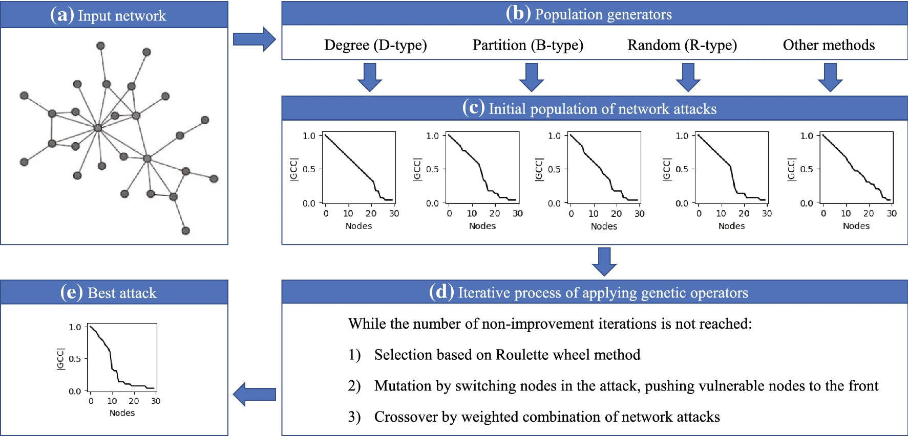
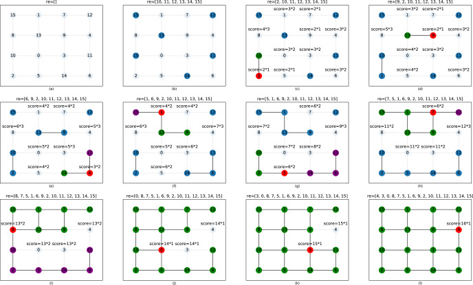
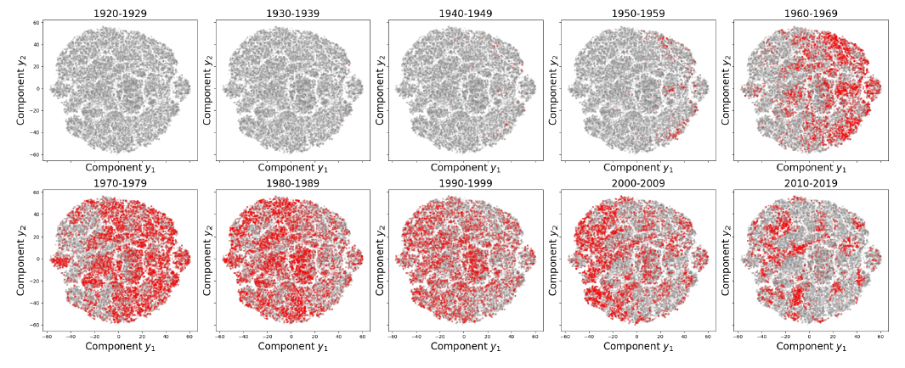

I am currently a third-year undergraduate student at [Beihang University](www.buaa.edu.cn)  My research interests include complex network, machine learning and intelligent transportation system. 

I spent wonderful time and laid a solid foundation in complex network in [M3Nets](m3nets.de) at National Key Laboratory of CNS/ATM, supervised by Prof. [Sebastian Wandelt](http://m3nets.de/group/sw.html). Moreover, I did some data mining research with Prof. [Sun Leilei](http://scse.buaa.edu.cn/info/1080/6322.htm) during scientific research course. 

## Education

   <table style="width:100%;border:0px;border-spacing:0px;border-collapse:separate;margin-right:auto;margin-left:auto;">
                <tbody>
                    <tr>
                        <td style="padding:20px;width:30%;vertical-align:middle">
                            
                        </td>
                        <td style="padding:20px;width:100%;vertical-align:middle">
                            <a href="https://ev.buaa.edu.cn/">
                                <papertitle>Beihang University, China</papertitle>
                            </a>
                            

                            <em>BEng in mechanical engineering (with honors)</em>   2019.09 - 2023.06(expected)
                            

                            <strong>GPA: 3.83/4 90.7/100</strong> 
                            
Courses: Calculus (100/100), Computer Science and Programming (100/100), Data Management and Artifitial Intelligence (100/100), Probability and Statistic (100/100), Introduction to deep learning and its applications (96/100), Linear Algebra (95/100), Natural Language Processing (91/100) 

                        </td>
                    </tr>
                </tbody>
            </table>

## Publication

 <table style="width:100%;border:0px;border-spacing:0px;border-collapse:separate;margin-right:auto;margin-left:auto;">
                <tbody>
                    <tr>
                        <td style="padding:20px;width:30%;vertical-align:middle">
                            
                        </td>
                        <td width="100%" valign="middle">
                            <a href="https://link.springer.com/article/10.1007/s00500-021-06475-w">
                                <papertitle>Efficient network dismantling through genetic algorithms</papertitle>
                            </a>
                             
                            <strong>Wei Lin</strong>, <a href="http://m3nets.de/group/sw.html">Sebastian Wandelt,</a> <a href="http://m3nets.de/group/xs.html">Xiaoqian Sun</a>
                             
                            <em>Soft Computing</em>, 2021  <strong>IF=3.643 (Q2)</strong>
                             
                            <a href="../files/SOCO.pdf">pdf</a> 
                            
In this study, we propose a novel network attack technique based on genetic algorithms. Results show that our novel technique significantly outperforms the state-of-the-art methods, providing an interesting sweet spot between attack quality and computational complexity.

                        </td>
                    </tr>
                    <tr>
                        <td style="padding:20px;width:30%;vertical-align:middle">
                            
                        </td>
                        <td width="100%" valign="middle">
                            <a href="https://www.sciencedirect.com/science/article/abs/pii/S0951832021006335?via%3Dihub">
                                <papertitle>From random failures to targeted attacks in network dismantling</papertitle>
                            </a>
                             
                            <a href="http://m3nets.de/group/sw.html">Sebastian Wandelt</a>, <strong>Wei Lin</strong>, <a href="http://m3nets.de/group/xs.html">Xiaoqian Sun</a>
                             
                            <em>Reliability Engineering & System Safety</em>, 2021  <strong>IF=6.188 (Q1) </strong>
                             
                            <a href="../files/RESS.pdf">pdf</a>
                            
In this study, we propose a novel perspective to solve the network dismantling problem. Instead of designing an effective attack from scratch, we show how knowledge extracted from random failures in the network leads to extremely effective attacks. Experiments on a wide range of networks show the
efficacy of our novel method for network dismantling, providing an excellent trade-off between attack quality
and scalability.

                        </td>
                    </tr>
                </tbody>
            </table>
## Project

 <table style="width:100%;border:0px;border-spacing:0px;border-collapse:separate;margin-right:auto;margin-left:auto;">
                <tbody>
                    <tr>
                        <td style="padding:20px;width:30%;vertical-align:middle">
                            
                        </td>
                        <td style="padding:20px;width:70%;vertical-align:middle">
                            <papertitle>Unveil the Mystery behind Musical Evolution</papertitle>
                            

                            <strong> The finalist price of Interdisplinary Contest In Modeling (ICM)</strong> <a href='../files/icmmcm_certificate.pdf'>Certificate of Achievement</a>
                            

                             
                            2021.02  
                             
                            Supervised by <a href="http://m3nets.de/group/sw.html">Prof. Sebastian Wandelt</a>
                             
                            <a href="../files/icmmcm.pdf">pdf</a>
                            <ul style="padding-left:20px;margin:5px">
                                <li>
                                    Build up a computational framework to evaluate the effect of musical influence on the temporal and spatial development
of artist and genre.
                                </li>
                                <li>
                                    Use Heterogeneous Euclidean-Overlap Metric to measure the music similarity.
                                </li>
                                <li>
                                    Propose the General Index of Genre Development based on the combined effect of I-index, popularity and release
frequency of intra-genre artists.
                                </li>
                        </td>
                    </tr>
                    </tbody>
            </table>

## Awards

2019-2021 Studies Excellent Scholarship of BUAA  (Top 10%)

2019-2020 University-level Excellent Student (Top 5%)

2020-2021 University-level merit student (Top 5%)

2020-2021 University-level social work Outstanding Second prize (Top 20%)

